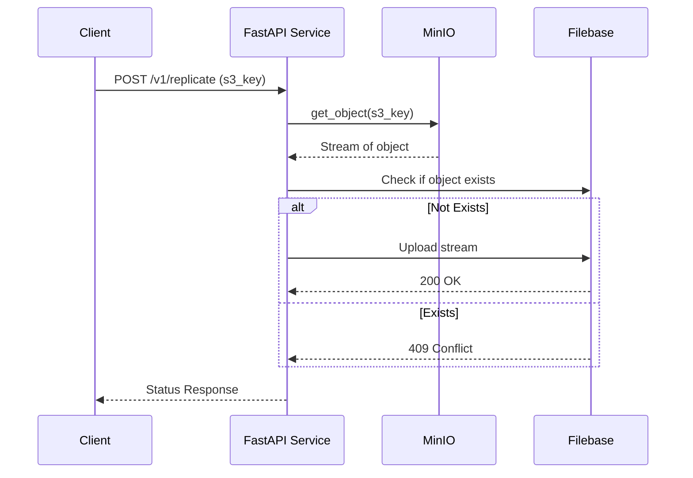

# 🌐 Cross-Cloud Event-Driven Storage Replicator

## 🧠 Context

This project implements an **event-driven**, **cross-cloud object replication** service, designed to simulate **real-world** cloud resilience by replicating data between **two object storage providers**.

Instead of paid cloud providers (AWS S3 and Google Cloud Storage), this project uses **MinIO** (self-hosted S3-compatible storage) as the source and **Filebase** (S3-compatible object storage) as the destination — allowing a cost-free, developer-friendly multi-cloud simulation.

## 🎯 Objective

Automatically **replicate** an object from a **self-hosted source storage (MinIO)** to a **cloud storage provider (Filebase)** in response to a trigger event.

## 🚀 Features

- 📡 **Event-Driven API** via POST `/v1/replicate`

- 💾 **Streamed Transfer** of objects (no full local download)

- 🔐 **Secrets & Configuration via Environment Variables**

- 🔁 **Idempotency**: Skips upload if file already exists at destination

- 🐳 **MinIO** deployed with Docker on **Railway**

- ⚡ Built using **FastAPI**

## 🧪 Stack Overview

| Layer               | Technology Used          |
| ------------------- | ------------------------ |
| Web Framework       | FastAPI                  |
| Language            | Python 3.11              |
| Source Storage      | MinIO (S3-compatible)    |
| Destination Storage | Filebase (S3-compatible) |
| SDKs Used           | `boto3`                  |
| Deployment (MinIO)  | Docker + Railway         |

## 📁 Project Structure

```bash
.
├─── replicate_to_filebase.py   # Core streaming logic (all files at once)
├─── upload_to_minio.py         # Upload files to MinIO
├─── list_buckets_and_objects.py # List down all bucket and object details
├─── delete_bucket.py           # Delete existing bucket from MinIO
├─── replicator.py              # rplicates via API endpoint (one file at a time)
├─── requirements.txt           # required packages
├─── .gitignore                 # ignore imp files
├─── LICENSE           # license
└─── README.md                  # You're here rn
```

## ⚙️ Configuration

All credentials and bucket names are defined via **environment variables**:

### Required `.env` Variables

```bash
# MinIO (source)
MINIO_ENDPOINT=https://your-minio-url:9000
MINIO_ACCESS_KEY=your-minio-access-key
MINIO_SECRET_KEY=your-minio-secret-key
MINIO_BUCKET=source-bucket

# Filebase (destination)
FILEBASE_ENDPOINT=https://s3.filebase.com
FILEBASE_ACCESS_KEY=your-filebase-access-key
FILEBASE_SECRET_KEY=your-filebase-secret-key
FILEBASE_BUCKET=replicated-bucket
```

❗ The bucket names are pre-configured and not passed through the API payload.

## 📡 API Design

`POST /v1/replicate`  
Trigger replication of a specific object from MinIO to Filebase.

🔸 Request Payload

```bash
{
  "s3_key": "path/to/your-file.txt"
}
```

`s3_key` is the object's key/path in the **predefined MinIO bucket**.

🔸 Responses

| Code | Description                                    |
| ---- | ---------------------------------------------- |
| 200  | Object replicated successfully                 |
| 409  | Object already exists in Filebase(idempotency) |
| 500  | Unexpected error occurred                      |

## 🔁 Replication Logic

### ✅ Source: MinIO

- Connects using `boto3.client(...)` to MinIO endpoint.

- Streams the object `using get_object()['Body']`.

### ✅ Destination: Filebase

- Before uploading, checks if the file exists using `head_object()`.

- If not found, uploads the stream using `upload_fileobj()`.

## 🧠 Idempotency

To avoid duplicate uploads:

- The replicator first checks if the object exists on **Filebase**.

- If it exists, it skips upload and returns `409 Conflict`.

## 📊 Sequence Diagram



## 🧪 Testing the API

**Sample cURL**

```bash
curl -X POST http://localhost:8000/v1/replicate \
  -H "Content-Type: application/json" \
  -d '{
    "s3_key": "hello.txt"
  }'

```

Replace `hello.txt` with any object key already present in your MinIO bucket.

## 🧪 Supporting Utilities

| Script                      | Purpose                                         |
| --------------------------- | ----------------------------------------------- |
| upload_to_minio.py          | Upload sample files to MinIO                    |
| list_buckets_and_objects.py | Inspect MinIO buckets and contents              |
| delete_bucket.py            | Cleanup MinIO buckets                           |
| replicate_to_filebase.py    | Replicate all buckets at once                   |
| replicator.y                | Core logic used by the `/v1/replicate` endpoint |

## 🐳 Deploying MinIO with Docker on Railway

You containerized MinIO and hosted it on Railway using this simplified Dockerfile:

```bash
FROM minio/minio
CMD ["server", "/data"]
```

Then used:

```bash
minio server /data --console-address ":9001"
```

The public endpoint from Railway is used as `MINIO_ENDPOINT`.

## 🙋‍♂️ Author

Linkedin: [Abhishek Ganapure](https://www.linkedin.com/abhishek-ganapure/)  
GitHub: [Abh3shek](https://github.com/Abh3shek/)
